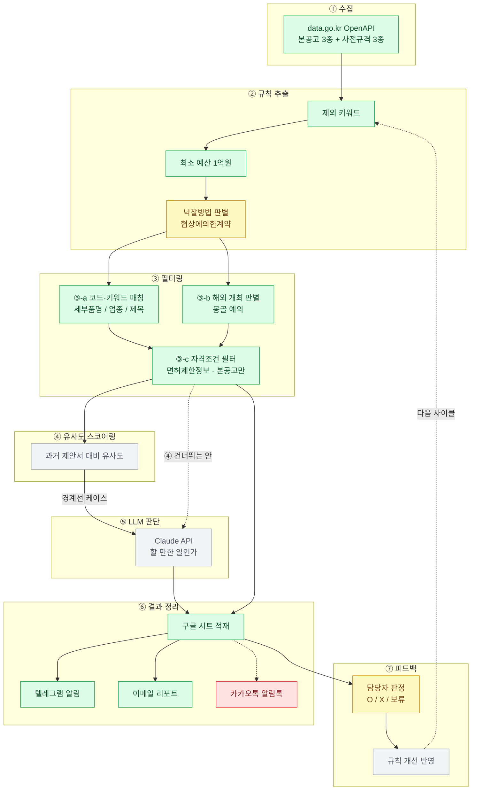

# 나라장터 입찰 모니터링 — 파이프라인 현황

갱신일: 2026-09-17

7단계 파이프라인의 **현재 구현 상태**와 **남은 작업**을 한 장에 정리한 문서입니다.
설계안이 아니라 "지금 코드가 실제로 무엇을 하고 있는가"의 기록입니다.

## 전체 흐름

🟩 구현 완료 · 🟨 부분 구현 · ⬜ 미착수 · 🟥 보류

## 단계별 상태

### ① 수집 — 🟩 완료

`src/api/` · 본공고(입찰공고정보서비스) + 사전규격(사전규격정보서비스)을 물품/용역/공사
3종씩 총 6개 오퍼레이션으로 조회. 페이지네이션·재시도·부분실패 처리 포함.

### ② 규칙 추출 — 🟨 부분

| 항목 | 상태 | 비고 |
|---|---|---|
| 제외 키워드 | 🟩 | `config/keywords.json` |
| 최소 예산(1억원) | 🟩 | 예산 미상은 통과시킴 |
| 낙찰방법 판별 | 🟨 | 코드는 있으나 **필터로는 미적용** |

낙찰방법은 `src/matching/bidMethod.ts`의 `isNegotiatedContract()`가 담당합니다.
`sucsfbidMthdNm` 필드에서 값을 받아오는 것을 실측 확인했고(2026-09-16),
2026-09-17 실행에서 `협상에의한계약-협상에 의한 낙찰자 결정` 표기가 실제로 잡히는 것까지
확인했습니다. 다만 **지금은 리포트에 표시만 하고 걸러내지는 않습니다** — 협상계약만
남길지는 사업 판단이 필요해 보류 중입니다.

사전규격은 이 단계에서 낙찰방법이 정해지지 않아 항상 `null`이며, `null`은
"판단 불가"로 보고 걸러내지 않습니다(fail-open).

### ③ 필터링 — 🟩 완료

- **③-a 코드·키워드 매칭** (`matchEngine.ts`) — 세부품명번호는 단독 매칭 인정,
  업종코드는 정밀도가 낮아 제목 키워드가 함께 있을 때만 인정
- **③-b 해외 개최 판별** (`overseasVenueFilter.ts`) — 전시회/박람회/엑스포 + 한국관/단체관
  조합을 해외 개최로 보고 자동 배제하되, **몽골은 예외로 남겨 표시**.
  몽골 판별은 다른 매칭과 **독립 트리거**입니다 — 국내 키워드가 하나도 없는 해외 공고도
  걸러지도록 하기 위함입니다
- **③-c 자격조건 필터** (`qualificationFilter.ts`) — 면허제한정보 API로 참가자격 대조.
  대응 API가 없어 **본공고에만** 적용됩니다

### ④ 유사도 스코어링 — ⬜ 미착수

**차단 요인: 비교할 과거 제안서 데이터가 없습니다.**
회사에서 과거 수행/검토 이력을 받아야 시작할 수 있습니다(아래 "회사에 요청할 데이터" 참고).

### ⑤ LLM 판단 — ⬜ 미착수

Claude API(`@anthropic-ai/sdk`, `claude-opus-5`) 연결이 필요합니다.
API 키는 GitHub Secrets에 넣고 토큰당 과금되며, **월 최소 청구액이 없습니다.**

우리 볼륨(경계선 케이스 월 150건 가정, 건당 입력 ~2,000 / 출력 ~400 토큰) 기준 예상 비용:

| 모델 | 단가(입력/출력, 1M토큰당) | 월 예상 |
|---|---|---|
| Claude Opus 5 | $5 / $25 | 약 $3 |
| Claude Sonnet 5 | $2 / $10 | 약 $1.2 |
| Claude Haiku 4.5 | $1 / $5 | 약 $0.6 |

**④를 건너뛰고 ⑤가 직접 판단하는 안**도 검토 중입니다(위 점선 경로). 전 건을 LLM에
돌려도 월 몇천 원 수준이라 비용상 가능하고, ④가 요구하는 과거 제안서 DB 구축을
기다리지 않아도 됩니다.

### ⑥ 결과 정리 — 🟩 완료 (카카오톡 제외)

| 매체 | 상태 | 비고 |
|---|---|---|
| 구글 시트 | 🟩 | `src/sheets/` · 매 실행마다 신규 공고를 행으로 적재 |
| 텔레그램 | 🟩 | `src/notify/` · Bot API, 무료, 서버 불필요 |
| 이메일 | 🟩 | 기존 경로 유지 |
| 카카오톡 알림톡 | 🟥 보류 | 사업자 심사·CSP 계약·월 최소 청구액 부담. 초기모델 이후 재검토 |

발송 순서는 **시트 → 텔레그램 → 이메일**입니다. 담당자가 알림을 보고 시트를 열었을 때
해당 행이 이미 있어야 하고, SMTP가 죽어도 알림은 가야 하기 때문입니다.
셋 중 하나가 실패해도 나머지는 그대로 진행됩니다.

### ⑦ 피드백 — 🟨 부분 (쓰기만 구현)

**구현됨 — 시스템 → 시트 (쌓기)**
매 실행마다 신규 공고를 구글 시트에 한 줄씩 추가합니다. 공고번호로 중복을 걸러
담당자가 이미 판정해둔 행은 건드리지 않습니다.

**미구현 — 시트 → 시스템 (읽어서 규칙 고치기)**
판정 데이터가 쌓여야 의미가 생기므로 몇 주 운영 후 착수합니다.

#### 시트 열 구성

| 열 | 채우는 주체 | 왜 필요한가 |
|---|---|---|
| 공고번호 | 시스템 | 중복 제거 키 |
| 구분 / 업무 / 공고명 / 발주기관 / 예산 / 마감 | 시스템 | 담당자가 보고 판단할 정보 |
| 낙찰방법 | 시스템 | 협상계약 트랙 분리 분석 |
| 추천등급 | 시스템 | 등급별 정확도 측정 |
| **매칭근거** | 시스템 | **어느 규칙이 걸었는지 — 규칙 개선의 핵심** |
| 해외의심 | 시스템 | ③-b 성능 추적 |
| 링크 / 수집일시 | 시스템 | 추적 |
| **판정** | 담당자 | O / X / 보류 (드롭다운) |
| **오판사유** | 담당자 | "분야는 맞는데 예산이 작다" vs "아예 다른 업종" |
| 판정자 / 판정일 | 담당자 | 추적 |

> **매칭근거 열이 없으면 이 표는 쓸모가 없습니다.** 판정(O/X)만 남기면 3개월 뒤에
> "어느 규칙이 이걸 잘못 걸었는지"를 되짚을 수 없어 규칙을 고칠 수가 없습니다.

이 표가 쌓이면 ⑤단계 LLM 판단의 학습 예시로 그대로 쓸 수 있습니다. 특히 **"검토했지만
입찰하지 않은 건"** 데이터가 자동으로 만들어지는데, 이건 회사에 따로 요청해도 기록이
남아 있지 않은 경우가 많은 자료입니다.

## 회사에 요청할 데이터

PoC4(협상계약 7건 실측) 결과 대비 현재 `config/held-qualifications.json`에는
**등록업종·등록물품 코드만** 있습니다.

### 1순위 — 없으면 자동 판단이 불가능

1. **용역 수행실적 대장(최근 5년)** — 사업명 / 발주기관 + 기관성격 / 계약금액(VAT 구분) /
   준공일 / **원도급·하도급 구분**. PoC4에서 7건 중 1건(안성 고삼호수)이 실적을
   탈락요건으로 걸었고, 그 문구를 판단하려면 이 5개 축이 모두 필요합니다
2. **직접생산확인증명서 보유 현황** — 품목코드 + 유효기간. PoC4 7건 중 4건이 명시적
   탈락요건으로 요구했습니다. 등록물품 코드와는 **다른 서류**입니다
3. **등록업종 2건의 유효기간 확인** — `8115169901 공간정보DB구축서비스`,
   `9015180201 전시회기획및대행서비스`. 만료됐다면 지금 시스템이 **없는 자격으로
   매칭하고 있는 중**입니다

### 2순위 — 정확도 향상

4. **해외건설업 신고필증 보유 여부(O/X)** — PoC4에서 UAE 두바이 건의 유일한 탈락 사유.
   ③-b 해외 필터의 유효성이 여기 걸려 있습니다
5. 신용평가등급 — PoC4 7건 전부 등급 커트라인 없이 "확인서 제출"만 요구. 자동 판단
   우선순위는 낮음
6. 경영상태(직전 3개년 재무제표, 부채비율·유동비율) — 적격심사 트랙용

### 3순위 — ④⑤단계용

7. **과거 입찰 검토 이력** — 수주 / 실주 / **검토했지만 입찰 안 한 건 + 그 이유**.
   마지막 항목이 가장 가치 있는데 보통 기록이 없습니다. 담당자 기억에 남은 10~20건만
   정리해도 충분합니다

### 요청 불필요

기술인력 보유현황, ISO 인증, 특허·디자인권, 중소기업/여성기업 확인서 —
전부 **배점 항목**이지 탈락요건이 아닙니다. 현재 파이프라인은 "자격이 되는가(Y/N)"만
다루므로 제안서 점수 예측 단계에 가서 받으면 됩니다.

## 남은 작업 (우선순위 순)

1. 구글 서비스 계정 발급 + 시트 공유 → `npm run test:sheets`로 연결 확인
2. 텔레그램 봇 생성 + chat_id 확보 → `npm run test:telegram`으로 확인
3. 회사 데이터 1순위 3건 확보
4. 몇 주 운영하며 판정 데이터 축적
5. ⑤ LLM 판단 착수 (④ 경유 / 직접 판단 중 택일)
6. ⑦ 시트 읽어서 규칙 자동 개선
7. 표본 확대 · 몽골 도시명 실측 · 면허제한정보 API의 협상계약 커버리지 검증

## 관련 문서

- [PoC4 — 협상계약 자격요건 스캔규칙 검증](PoC4_협상계약_자격요건_스캔규칙_검증.md)
- [카카오톡 알림 도입 제안](카카오톡_알림_도입_제안.md)
- [HANDOFF.md](../HANDOFF.md) — 배포 구조 주의사항
